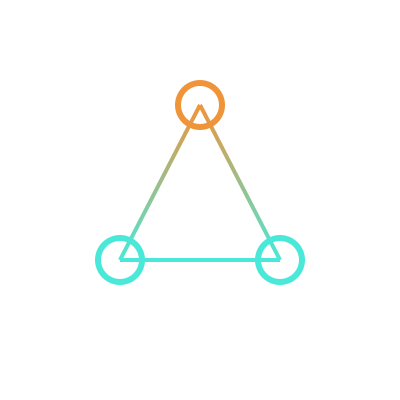

  

<h1 align="center">Kenning AI · Community</h1>

  Public Q&A, patterns, and announcements for graph-native intelligence. 
  <a href="../../discussions">→ Discussions</a>  ·  <a href="https://kenningai.com">kenningai.com</a>

---

This repo isn't code. It's the home for [Discussions](../../discussions). The rest of Kenning AI lives at [kenningai.com](https://kenningai.com) and in the other repos on this org.

## What's here

**[Q&A](../../discussions/categories/q-a)** — Architecture questions, modeling problems, debugging help. *How would you structure this ontology? Why does traversal explode when I add this edge? Is this a temporal problem or an indexing problem?* Post freely — the answers compound into a searchable reference.

**[Patterns](../../discussions/categories/patterns)** — Canonical use cases, written up as small architecture walkthroughs. Each one: a diagram, 200–400 words, the decision points worth thinking about. Early patterns will cover fraud triage with the graph as reviewer-memory, temporal knowledge transfer between agents, and federated ontology joins across disconnected data domains.

**[Announcements](../../discussions/categories/announcements)** — Releases, talks, papers. Low volume, maintainer-only posts.

**[General](../../discussions/categories/general)** — Everything else.

## Ground rules

- Be precise. Vague questions get vague answers.
- Search before posting — the forum exists so questions compound instead of repeat.
- No product pitches. No recruiter DMs. This is a technical space.
- Disagreement is welcome. Condescension isn't.

## Canonical open-source

- [**mcp-neo4j-memory**](https://github.com/kenningai/mcp-neo4j-memory) — Temporal knowledge graph memory for AI agents
- [**gds-agent-native**](https://github.com/kenningai/gds-agent-native) — Graph Data Science operations as native agent tools
- [**mcp-neo4j-cypher**](https://github.com/kenningai/mcp-neo4j-cypher) — Direct Cypher execution through Model Context Protocol

## A note on the name

In Old Norse poetry, a *kenning* names things not by what they are, but by their relationships to other things. A ship is a "wave-steed." The ocean is "whale-road." A sword is a "wound-hoe." The thing has no meaning in isolation — meaning is constituted by relationship.

That's the thesis. This is where we build it in public.
